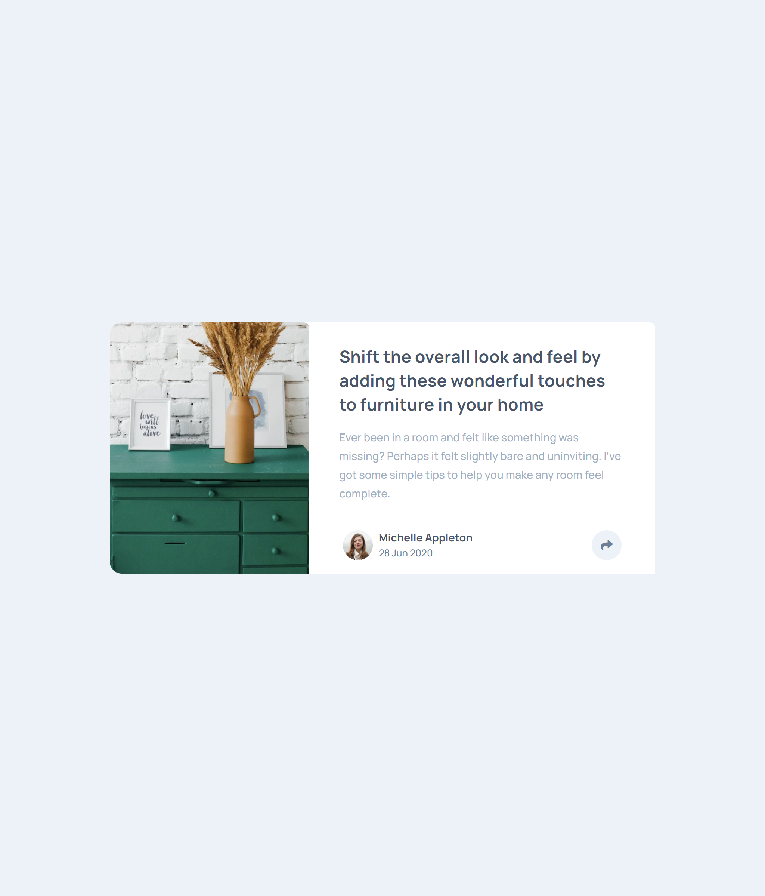
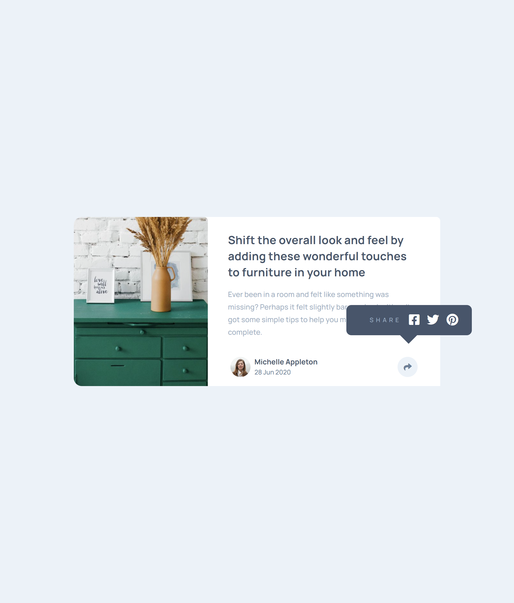
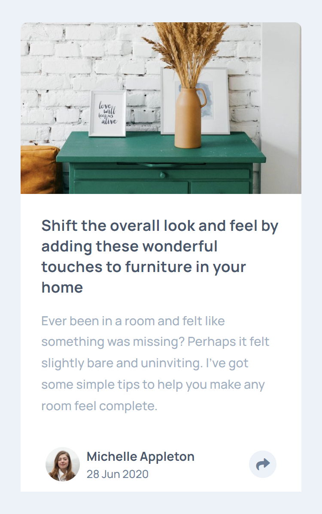
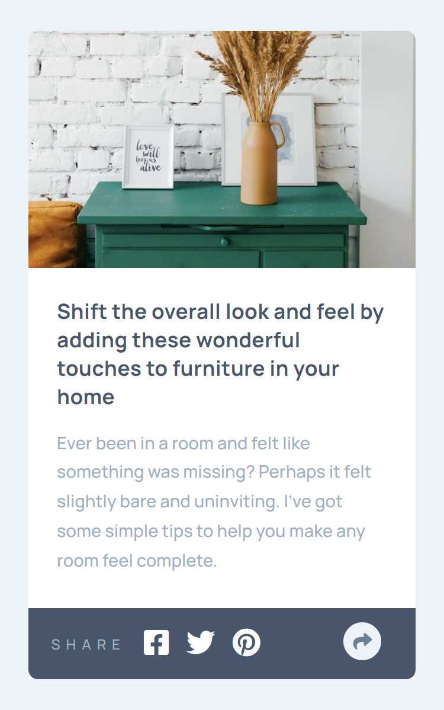

# Frontend Mentor - Article preview component solution

This is a solution to the [Article preview component challenge on Frontend Mentor](https://www.frontendmentor.io/challenges/article-preview-component-dYBN_pYFT). Frontend Mentor challenges help you improve your coding skills by building realistic projects.  

## Table of contents

- [Overview](#overview)
  - [The challenge](#the-challenge)
  - [Screenshot](#screenshot)
  - [Links](#links)
- [My process](#my-process)
  - [Built with](#built-with)
- [Author](#author)

## Overview

## The challenge

- View the optimal layout for the component depending on their device's screen size
- See the social media share links when they click the share icon

### Screenshot

 | 

### Links

- [Solution URL](https://www.frontendmentor.io/profile/vikrantmalla)
- [Live Server](https://vikrantmalla.github.io/Article-preview-component/)

### Built with

- HTML
- SCSS
- JavaScript
- Media Queries
- Mobile-first workflow

## Author

- GitHub - [Vikrant Malla](https://github.com/vikrantmalla)
- Frontend Mentor - [@vikrantmalla](https://www.frontendmentor.io/profile/vikrantmalla)
